<div align="center">

```
                            ╔══════════════════════════════════════════════════════════════╗
                            ║          T H E   M A T R I X   A W A K E N S                 ║
                            ║     "Wake up, Neo. The Matrix has you." — Morpheus           ║
                            ╚══════════════════════════════════════════════════════════════╝
```

# The Matrix Awakens
### AI-Powered Cybersecurity Portfolio — Edge Architecture

[](https://the-matrix-awakens.vercel.app)
[](https://the-matrix-awakens.premmadishetty.workers.dev/api/health)
[](#)

**Built by [Prem Madishetty](https://www.linkedin.com/in/madishettyprem/) — MS Cybersecurity Management @ SDSU**

*A zero-operational-cost, edge-native portfolio that doesn't just show you what I know — it demonstrates it.*

</div>

---

## ⚡ What Makes This Different

Most portfolios are static HTML. This one is a **live security system**.

- 🤖 **The Sentinel** — A clinical AI proxy (Llama 3.1 via Groq) that represents me in real-time. Trained on my resume. Stoic. Precise. Intercepts off-topic queries with `[SECURITY_INTERCEPT]`.
- 🛡️ **Edge-hardened backend** — Cloudflare Workers with Hono, rate limiting, secure headers, CORS validation, and full input sanitization.
- 📊 **Live analytics dashboard** — Tracks every visitor: IP, geolocation, browser, device, session duration, click patterns. Password-gated admin console.
- 🔍 **Lead intelligence** — Detects high-intent visitors (resume/hire/connect keywords) and fires instant email alerts via Resend.
- ☯️ **Tri-mode theme engine** — Light → Matrix flash → Dark. Every nav click triggers a reality-dissolve breach animation.
- 💾 **Zero operational cost** — Cloudflare Workers free tier (100k req/day) + D1 SQLite + Vercel Hobby. $0/month.

---

## 🖥️ Portfolio — Live Screenshots

<table>
<tr>
<td width="50%">

**Matrix Mode — Glitch Transition**
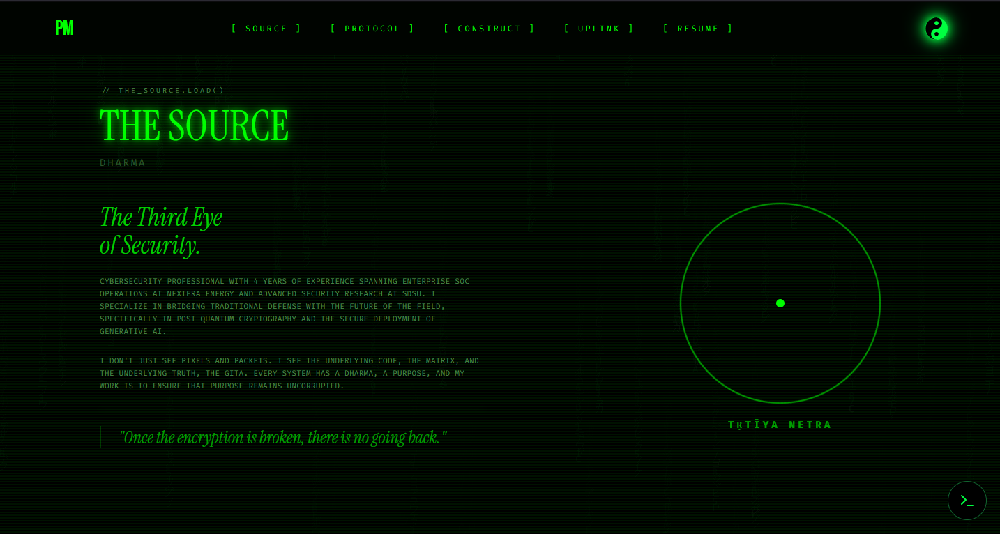
*Every navigation click triggers a full-screen Matrix breach animation with chromatic aberration and color inversion flashes*

</td>
<td width="50%">

**Dark Mode**
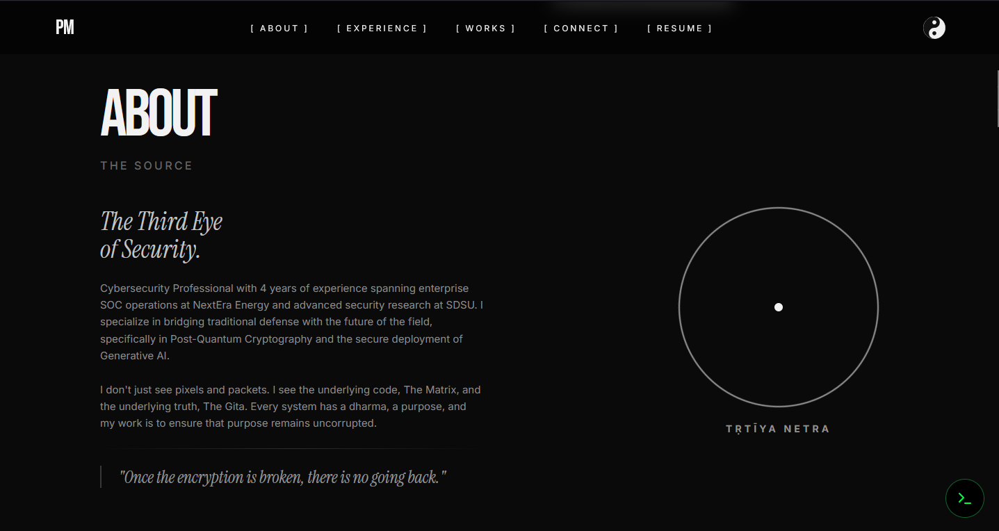
*Tri-mode theme engine: Light ↔ [Matrix flash] ↔ Dark. Theme state persists through breach transitions via baseModeRef.*

</td>
</tr>
<tr>
<td width="50%">

**The Sentinel — AI Chatbot**
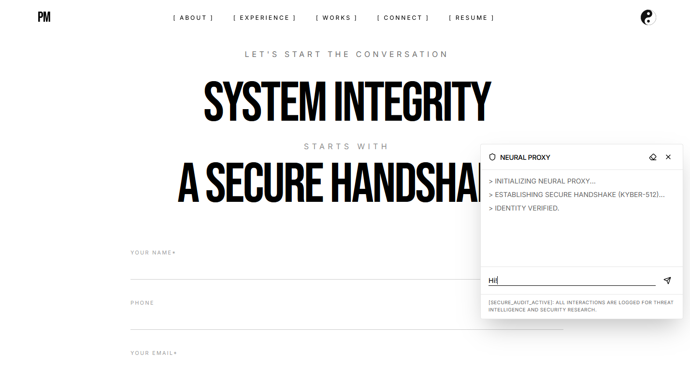
*Kyber-512 handshake sequence on open. Typewriter effect responses. Trained exclusively on operator resume data. Non-technical queries trigger [SECURITY_INTERCEPT].*

</td>
<td width="50%">

**Development Environment**
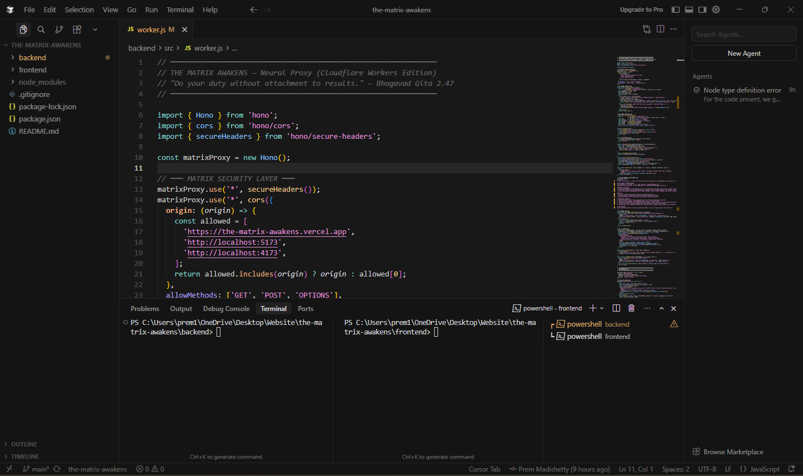
*TypeScript + React 18 + Vite frontend. Cloudflare Workers backend. Full hot-reload local dev via wrangler dev.*

</td>
</tr>
</table>

---

## 📊 Admin Analytics Dashboard

> Password-gated at `/admin?key=SECRET` — served directly from the Cloudflare Worker. Zero separate hosting.

<table>
<tr>
<td width="50%">

**Admin Login Gate**
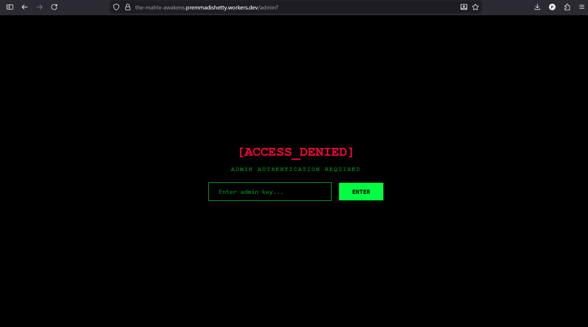
*Matrix-themed authentication gate. Key passed as URL query param or typed into the terminal-style input.*

</td>
<td width="50%">

**KPI Dashboard**
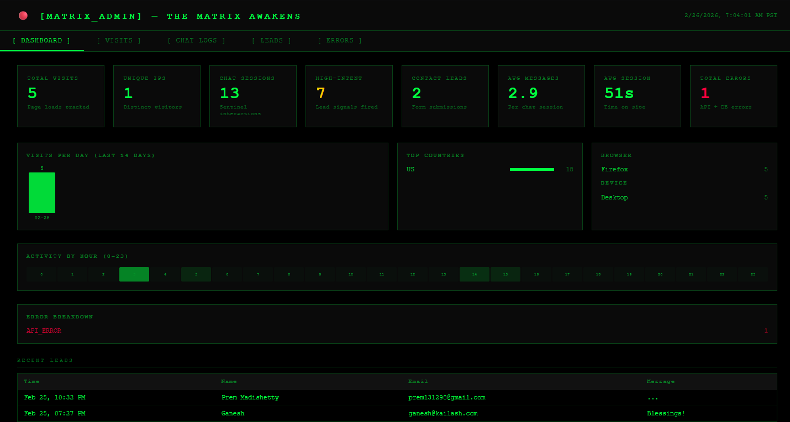
*8 live KPIs: Total Visits, Unique IPs, Chat Sessions, High-Intent leads, Avg Messages, Avg Session Time, Contact Leads, Errors. Visits-per-day bar chart + hourly heatmap.*

</td>
</tr>
<tr>
<td width="50%">

**Visits Master Table**
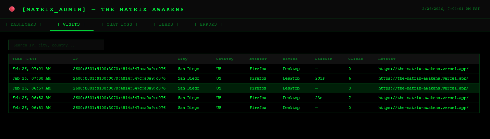
*Every page load logged: IP, geolocation, browser, device type, session duration, click count, referer. Searchable.*

</td>
<td width="50%">

**Chat Logs — Full Audit Trail**
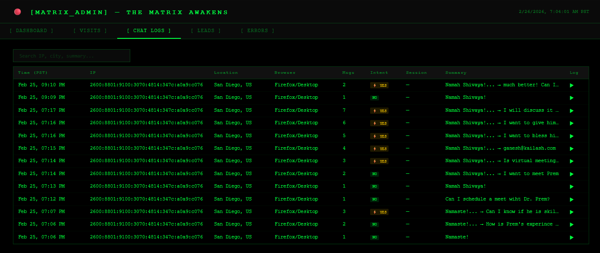
*Every Sentinel interaction logged with full transcript, high-intent flag, message count, and one-click conversation viewer.*

</td>
</tr>
<tr>
<td width="50%">

**Leads — Contact Submissions**
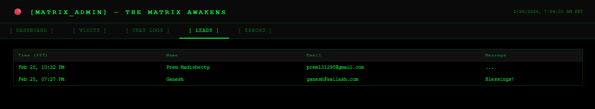
*Every contact form submission with full message. Also triggers Resend email alert to operator in real time.*

</td>
<td width="50%">

**Error Log**
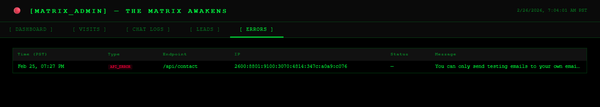
*API failures, DB errors, and rate limit hits logged with endpoint, IP, status code, and timestamp.*

</td>
</tr>
</table>

---

## 🌐 Infrastructure — Live Service Dashboards

<table>
<tr>
<td width="33%">

**Cloudflare Workers**
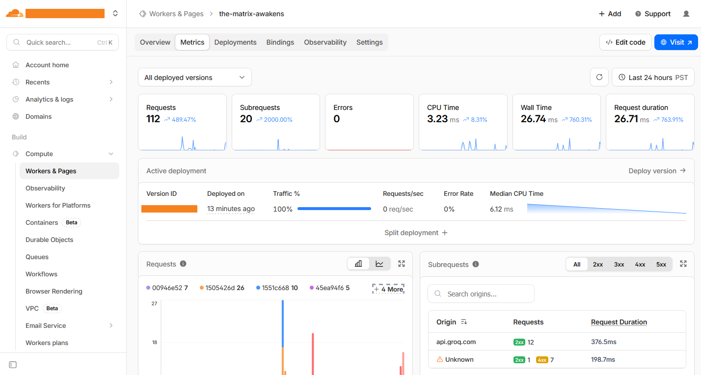
*Edge runtime — deployed globally across 300+ PoPs. Sub-50ms cold start.*

</td>
<td width="33%">

**Groq API (AI Inference)**
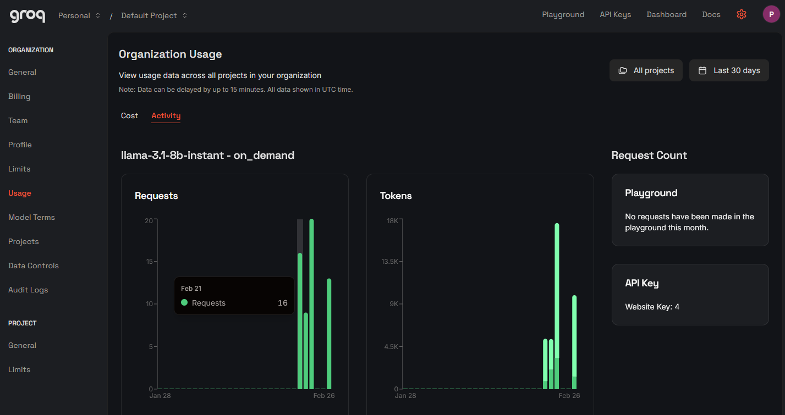
*Llama 3.1 8B Instant. ~200ms inference. Powers The Sentinel.*

</td>
<td width="33%">

**Resend (Email)**
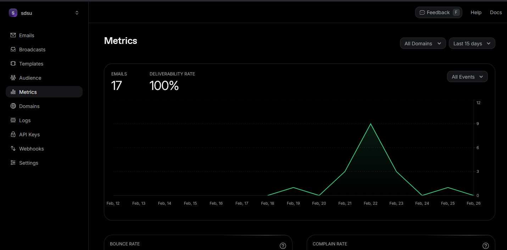
*Transactional email for lead alerts and contact form notifications.*

</td>
</tr>
<tr>
<td colspan="3">

**Vercel (Frontend CDN)**
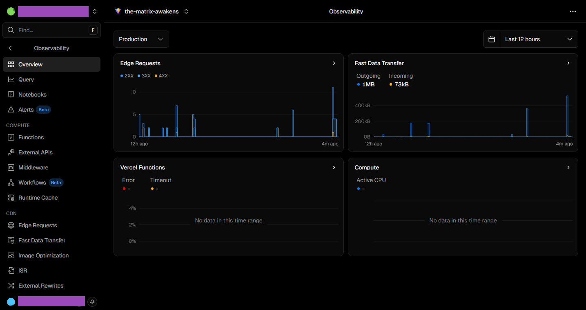
*React SPA deployed on Vercel edge network. Auto-deploys on every GitHub push.*

</td>
</tr>
</table>

---

## 🏗️ System Architecture

```
╔═══════════════════════════════════════════════════════════════╗
║                    SYSTEM ARCHITECTURE                        ║
╚═══════════════════════════════════════════════════════════════╝

  VISITOR
    │
    ▼
┌──────────────────────────────────────────────────────────┐
│  STAGE 1: TERMINAL SCREEN                                │
│  > INITIALIZING NEURAL PROXY...                          │
│  > VERIFYING OPERATOR IDENTITY...                        │
│  > ACCESS GRANTED. WELCOME TO THE MATRIX.                │
└─────────────────────┬────────────────────────────────────┘
                      │
                      ▼
┌──────────────────────────────────────────────────────────┐
│  STAGE 2: MATRIX TRANSITION                              │
│  Katakana rain canvas + 3D perspective grid              │
│  Duration: ~2500ms → onComplete() fires                  │
└─────────────────────┬────────────────────────────────────┘
                      │
                      ▼
┌──────────────────────────────────────────────────────────┐
│  STAGE 3: PORTFOLIO SPA (Vercel)                         │
│  React 18 + Vite + TypeScript + Tailwind                 │
│  Tri-mode ThemeContext (light / matrix / dark)           │
│  useTracker() fires immediately → POST /api/track        │
└──────────┬───────────────────────────┬───────────────────┘
           │                           │
           ▼                           ▼
┌─────────────────────┐    ┌──────────────────────────────┐
│  THE SENTINEL CHAT  │    │  CLOUDFLARE WORKER (Edge)    │
│  Kyber-512 handshake│    │  ─────────────────────────── │
│  Typewriter effect  │    │  POST /api/chat  → Groq AI   │
│  3 processing states│    │  POST /api/track → D1 log    │
│  High-intent detect │───►│  POST /api/contact → Resend  │
└─────────────────────┘    │  GET  /api/health → status   │
                           │  GET  /admin     → dashboard │
                           └──────────┬───────────────────┘
                                      │
                    ┌─────────────────┼──────────────────┐
                    │                 │                  │
          ┌─────────▼──────┐ ┌────────▼───────┐ ┌───────▼──────┐
          │  GROQ API      │ │  CLOUDFLARE D1 │ │  RESEND      │
          │  Llama 3.1 8B  │ │  SQLite (Edge) │ │  Email API   │
          │  <200ms resp.  │ │  visits        │ │  Lead alerts │
          │                │ │  karma_logs    │ │  Contact     │
          └────────────────┘ │  lead_souls    │ │  alerts      │
                             │  error_logs    │ └──────────────┘
                             │  rate_limits   │
                             └────────────────┘
```

---

## 🔐 Security Architecture

```
╔═══════════════════════════════════════════════════════════════╗
║                  SECURITY LAYER STACK                         ║
╚═══════════════════════════════════════════════════════════════╝

  REQUEST ENTERS CLOUDFLARE EDGE
        │
        ▼ ──[1] secureHeaders() ── X-Content-Type, HSTS, CSP, X-Frame-Options
        │
        ▼ ──[2] CORS Shield ────── Origin validated against allowlist
        │
        ▼ ──[3] DharmaThrottle ─── 100 req / 15min per IP via D1 counter
        │
        ▼ ──[4] Input Validation ── Type check, empty guard, length caps
        │
        ▼ ──[5] Email RFC Audit ─── /^[^\s@]+@[^\s@]+\.[^\s@]+$/
        │
        ▼ ──[6] XSS Sanitization ── .trim().substring(0, maxLen)
        │
        ▼ ──[7] Admin Auth ──────── x-admin-secret header comparison
        │
  RESPONSE TRANSMITTED
```

---

## 🧬 Tech Stack

| Layer | Technology | Purpose |
|-------|-----------|---------|
| **Frontend** | React 18 + Vite + TypeScript | SPA framework |
| **Styling** | Tailwind CSS + Framer Motion | Theming + animations |
| **Backend** | Cloudflare Workers + Hono | Edge runtime (zero server cost) |
| **Database** | Cloudflare D1 (SQLite) | Analytics + lead storage |
| **AI Inference** | Groq API — Llama 3.1 8B | The Sentinel intelligence |
| **Email** | Resend | Lead detection alerts |
| **Security** | Hono secureHeaders + CORS + rate limit | Hardened API |
| **Frontend CDN** | Vercel | Global edge deployment |

---

## 📁 Repository Structure (Blueprint)

> ⚠️ This is an **architectural blueprint** repository. Method signatures and design patterns are documented here. Production implementation is private.

```
the-matrix-awakens/
│
├── 📄 README.md                          ← You are here
├── 📄 ARCHITECTURE.md                    ← Deep-dive system design
├── 📄 DEPLOYMENT.md                      ← Infrastructure setup guide
│
├── 🔵 backend/
│   └── server.blueprint.js               ← Full API + security blueprint
│
├── 🟢 frontend/
│   └── src/
│       ├── components/
│       │   └── components.blueprint.js   ← All component interfaces
│       └── contexts/
│           └── ThemeContext.blueprint.js ← Tri-mode engine design
│
└── 🖼️ media/                             ← Screenshots (this README)
    ├── dashboard.png
    ├── chat-logs.png
    ├── visits.png
    └── ...
```

---

## 👤 About the Operator

```
┌─────────────────────────────────────────────────────────┐
│  OPERATOR: PREM MADISHETTY                              │
│  LOCATION: San Diego, California                        │
│  CLEARANCE: MS Cybersecurity Management (GPA: 3.79)     │
│  AFFILIATION: SDSU AI4Business Lab | NextEra Energy SOC │
│  SPECIALIZATION: PQC · LLM Red Teaming · NIST AI RMF    │
└─────────────────────────────────────────────────────────┘
```

[](https://www.linkedin.com/in/madishettyprem/)
[](mailto:prem131298@gmail.com)
[](https://the-matrix-awakens.vercel.app)

---

<div align="center">

*"You have a right to perform your prescribed duties, but you are not entitled to the fruits of your actions."*
*— Bhagavad Gita 2.47*

**The Matrix Awakens. The simulation is live.**

</div>
